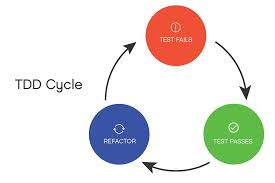
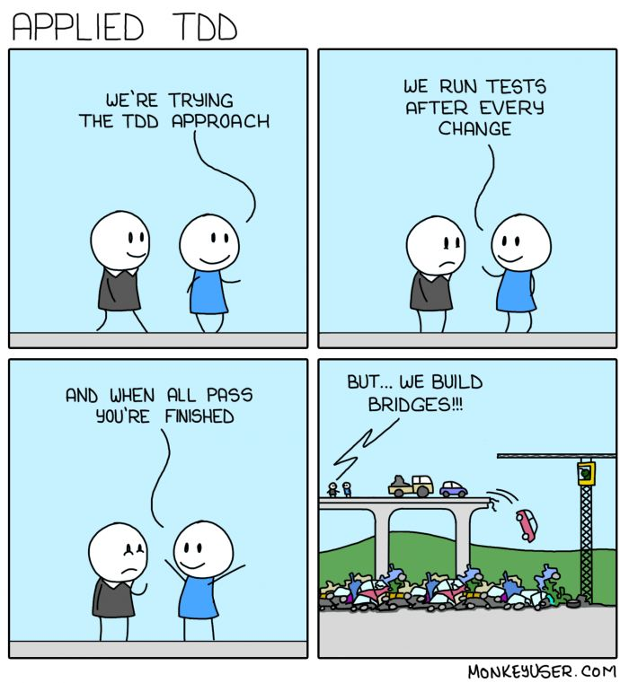

# docker-rspec

# What:

Understand how to setup Dockerfile tdd.

Rspec docker testing repo

Disclaimer:

## Usage: there are three branches, one for each phase of the tdd cycle.

* test0 is the initial tests where no code has been written.
* test1 The initial failed tests is fixed with the creation of a Dockerfile and test for ubuntu version are supposed to be successful.
* test2 A test is created to validate installation of nodejs.
